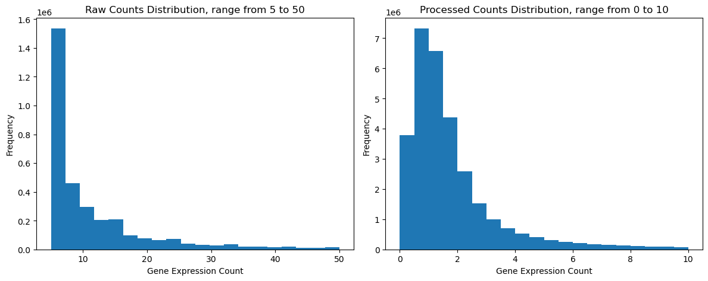

```{r setup, include=FALSE}
knitr::opts_chunk$set(echo = TRUE)
```

## Task 1: **Data Exploration**

### Overview

The data comes from a single cell experiment run on human bone marrow samples. The train set contain 72208 observations and 5000 variables, the test set contains 18052 observation and 5000 variables. The observations are unique barcodes corresponding to a single cell each, and variables are gene names, likely cut down to 5000 top differentially expressed genes.

Number of overlapping cells between those datasets is 18052, suggesting that test dataset is a subset of the train dataset.

There were 9 patients included in the study as indicated by number of unique `DonorID` entries. For each patient, we have information about their age, BMI, blood type, ethnicity and race, gender and whether they were a smoker or took any medication that could interfere as well as the site and batch that the sample comes from.

For each cell we have information about:

-   `n_genes_by_counts` or how many genes were expressed in the cell,
-   `pct_counts_mt`, how many genes were marked as mitochondrial,
-   `GEX_size_factors`, estimated size factor,
-   `GEX_phase`, estimated cell cycle phase,
-   `cell_type`, or to which immune cell population it belongs.

There were 45 distinct cell types present. There were 4 laboratories included as per number of unique `Site` entries. Batches are different groups of cells processed at different times or in different conditions, which may introduce technical variations (known as batch effect). In this study there were 12 batches, encoded in format dNsK, where dN means donor number N, and sK means site number K. Batches can be summarised as follows:

-   Site 1 - Donor 1, 2, 3
-   Site 2 - Donor 1, 4, 5
-   Site 3 - Donor 1, 6, 7
-   Site 4 - Donor 1, 8, 9

### Cell population composition

Below we present plot of observation for each cell type and patient. As we can see, they are not evenly distributed. The spike for one patient is due to the fact, that in each Site, Patient 1 sample was sequenced. But even after normalization, cell populations show significant variations in size. This might reflect very individual and time-varying nature of immune cell composition which is dependent on ongoing and previous infections, genetic makeup and other environmental factors.


### Data preprocessing

Due to the nature of scRNA-Seq experiments, the data are mostly composed of entries with 0 expression.

```         
Total elements: 361040000
Nonzero elements: 32228572
Zero elements: 328811428
Fraction of nonzero elements: 8.93%
```

Zero expression means that the gene is not transcribed in that particular cell. In bone marrow, which consists of a diverse population of cells, not all genes are expressed in every cell. This is normal, as different cell types have distinct functions and gene expression profiles. It also heavily depends on the stage of cell cycle that a given cell is currently in.

Below we present histograms for expression counts for raw data and preprocessed data. We can clearly see that it is dominated by low counts (of note, zero counts were excluded).


To better asses the distribution, we plotted histograms excluding low and high counts.



Those plots illustrate common features of RNA-seq count data. A low number of counts is associated with a large proportion of genes and a long tail because there is no upper limit for expression.

Usually, expression data are modeled with either Poisson or Negative Binomial distribution. After examining mean vs. variance plot of the expression data, Poisson distribution does not seem like a reasonable choice because of the mismatch between variance and mean, therefore we should use NB or zero-inflated NB.

When working with scRNA-Seq data, raw counts obtained experimentally need to be transformed for further analysis. At first, cells with low counts, and genes expressed in fewest cells are removed. Then, the data is normalized using different methods (median count depth in basic Scanpy workflow, linear models using negative binomial distribution, bayesian and others) and log transformed.

Provided data contains both raw count matrix and preprocessed one. We can compare basic statistics (calculated for nonzero entries):

```         
Raw: 
Min: 1.0 Max: 35451.0 Mean: 4.9526963 SD: 114.22376
Preprocessed: 
Min: 0.104286805 Max: 21078940.0 Mean: 38.395397 SD: 4813.9
```

As we can see, preprocessed data is not normalized and it was even inflated to higher values than raw counts. Expected data after standard Scanpy preprocessing (normalization across cells and log1p transform) would look somewhat like:

```         
Preprocessed: 
Min: 0.0169 Max: 6.8537 Mean: 0.7953 SD: 0.6292
```

Apparently, in our data Scran normalization was used. It is similar in that it also uses shifted logarithm transform. The only difference is that Scran leverages a deconvolution approach to estimate the size factors based on a linear regression over genes for pools of cells.

To verify, following transformation was applied to the original data `scran = adata_orig.layers["counts"] / adata_orig.obs["GEX_size_factors"].values[:, None]`(dividing counts for each cell by a corresponding size factor), which after selecting top highly expressed genes yeilded:

```         
Preprocessed: 
Min: 0.1043 Max: 21078939.4492 Mean: 35.5654 SD: 4273.4925
```

As we can see, the values are similar to those calculated from originally processed data up to perhaps methods of selecting genes etc. and that was probably the transformation applied.

Finally, to use our data as input for VAE training, it would be useful to have the data normalized by library size, reduced in size by selecting important features, both or which have been already done. Also, we could make the data more Gaussian, by taking the log transformation of preprocessed data and normalizing it to 0 mean and unit variance. We also saw before that the data are overdispersed, so we could use a transformation to stabilize variance across genes, for example Scanpy's Pearson residual normalization `scanpy.experimental.pp.normalize_pearson_residuals`.

## Autoencoders and VAEs

### Autoencoders

Autoencoders are a special kind of neural network used to perform dimensionality reduction. We can think of autoencoders as being composed of two networks, an **encoder** $E$ and a **decoder** $D$.

The encoder projects the data from the original high-dimensional input space $X$ to lower-dimensional latent space $Z$, creating what we call a latent vector $z=E(x)$, which is a representation of a data point aiming to preserve information about original data. The decoder does the contrary: it maps a vector from low-dimensional latent space to its representation in original space $Z$ to reconstruct original data $\hat{x} = D(z) = D(E(x))$. The autoencoder is just the composition of $E$ and $D$ and is trained to minimize the difference between $x$ and $\hat{x}$.

{width="255"}

### Variational autoencoders

When it comes to the autoencoders, the latent space $Z$ can become disjoint and non-continuous, because the autoencoder is solely trained to encode and decode with as few loss as possible, no matter how the latent space is organised. A variational autoencoder can be defined as being an autoencoder whose training is regularised to avoid overfitting and ensure that the latent space has good properties that enable generative process - instead of mapping the input into a fixed vector, we want to map it into a distribution

{width="255"}

Let us consider a graphical model.

{width="100"}

Sampling each data point includes two steps. The latent variables are drawn from a prior $p(z)$ and the data are conditioned on $z$ and sampled according to $p_{\theta}(x|z)$. Suppose we are interested in the latent variable, then by using Bayes' theorem we obtain posterior distribution $p(z|x) = \frac{p_{\theta}(x|z)p(z)}{\int p_{\theta}(x|z)p(z) dz }$. Unfortunately, this integral could be, and often is, intractable. In variational inference we approximate the posterior by some distribution $q_{\phi}(z|x)$, where $\phi$ is a parameter. To measure how closely $q$ approximates $p$ we use Kullback-Leibner divergence. The Kullback-Leibner divergence is defined as $D_{KL} (P \parallel Q) = \int p(x) \log{\frac{p(x)}{q(x)}}dx = E_{p} [ \log(p(x)) - \log(q(x))]$ and by minimizing it we ensure the two distributions are similar. In our case we minimise $$
\begin{aligned}
D_{KL} (q_{\phi}(z \mid x) \parallel p_{\theta} (z \mid x)) 
&= - E_{q} \Big[ \log(p_{\theta} (z , x)) - \log(p(x)) - \log(q_{\phi}(z \mid x)) \Big] \\
&= E_{q}[\log(q_{\phi}(z \mid x))] - E_{q}[\log(p_{\theta} (z , x))] + \log(p(x)),
\end{aligned}
$$

so we are interested in

$$
\hat{\theta}, \hat{\phi}  
= \arg\min_{\theta, \phi} D_{KL} (q_{\phi}(z \mid x) \parallel p_{\theta} (z \mid x)).
$$

### The evidence lower bound

Below, using Jensen's inequality we obtain the so called evidence lower bound, or ELBO:

$$ \log(p(x)) = \log \int_{z}( p(x, z)) = \log \int_{z}( p(x, z)) \frac{q_{\phi}(z \mid x)}{q_{\phi}(z \mid x)} = \log(E_{q}[\frac{p(x,z)}{q_{\phi}(z \mid x)}]) \geq E_{q}[\log(p(x,z))] - E_{q}[\log q_{\phi}(z \mid x)]$$

Now when we return to the KL divergence we see that: $D_{KL} (q_{\phi}(z \mid x) \parallel p_{\theta} (z \mid x)) = E_{q}[\log(q_{\phi}(z \mid x))] - E_{q}[\log(p_{\theta} (z , x))] + \log(p(x)) = -ELBO + \log(p(x))$. This is the negative ELBO plus the log marginal probability of $x$. Notice that $\log(p(x))$ does not depend on $q$, so, as a function of the variational distribution, minimizing the KL divergence is the same as maximizing the ELBO. The difference between the ELBO and the KL divergence is the log normalizer, which is what the ELBO bounds. We can rewrite ELBO as $$
\begin{aligned}
E_{q}[\log(p_{\theta}(x,z))] - E_{q}[\log q_{\phi}(z \mid x)] 
&= -  E_{q}[\log q_{\phi}(z \mid x)] + E_{q}[\log(p_{\theta}(z))] + E_{q}[\log(p_{\theta}(x \mid z))] \\
&= -D_{KL} (q_{\phi}(z \mid x) \parallel p_{\theta} (z)) + E_{q}[\log(p_{\theta}(x \mid z))],
\end{aligned}
$$ which we need to maximise. So, our loss function is simply $-ELBO$. The loss function of the variational autoencoder is the negative log-likelihood (or reconstruction loss, for examples MSE between data points and their reconstructions, $\parallel \hat{x} - x \parallel ^{2}$) with a regularizer. Because there are no global representations that are shared by all datapoints, we can decompose the loss function into only terms that depend on a single datapoint $l_i$. The total loss is then $\sum_{i=1}^N l_i$ for $N$ total datapoints. The loss function $l_i$ for datapoint $x_i$ is:

$$l_i(\theta, \phi) = -\mathbb{E}_{q_{\phi}} \left[ \log p_{\theta}(x_i | z) \right] + D_{KL}(q_{\phi}(z | x_i) || p(z)),$$

and because we assume our $p$ to be normally distributed, the $D_{KL}$ becomes $D_{KL}(q_{\phi}(z|x_{i})||p_{\theta}(z)) = -\frac{1}{2}\sum_{j=1}^{d}(1 + \log(\sigma_j^{2(i)}) - (\mu_j^{(i)})^2 - \sigma_j^{2(i)})$.

### The reparametrization trick

We want our samples to deterministically depend on the parameters of the distribution. For example, in a normally-distributed variable with mean $\mu$ and standard devation $\sigma$, we can sample from it like this $z = \mu + \sigma \odot \epsilon$, where $\epsilon \sim N(0,I)$ and is not parametrised by $\phi$. The reparametrization trick lets us backpropagate (take derivatives using the chain rule) with respect to $\phi$ through the objective (the ELBO) which is a function of samples of the latent variables $z$.

{width="200"}
